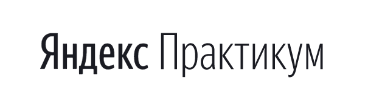

# Проект: Mesto

### Описание:
Учебный проект выполненный в рамках проектных работ по изучению JavaScript.

Интерактивная страница для добавления и удаления фотографий.

### Внешний вид сайта соответствует макетам:
https://www.figma.com/file/2cn9N9jSkmxD84oJik7xL7/JavaScript.-Sprint-4?node-id=0%3A1
https://www.figma.com/file/bjyvbKKJN2naO0ucURl2Z0/JavaScript.-Sprint-5?node-id=0%3A1
https://www.figma.com/file/kRVLKwYG3d1HGLvh7JFWRT/JavaScript.-Sprint-6?node-id=0%3A1

Разработан в рамках изучения JavaScript при прохождении курса
Web-разработчик от Яндекс.Практикум

При написании сайта использованы технологии:
- HTML
- CSS (Флексбокс-вёрстка, вёрстка на Грид, адаптивная верстка, позиционирование элементов, трансформации)
- Методология БЭМ (Nested)
- JavaScript
- Объектно-ориентированное программирование
- Webpack
### Ссылка на проект
https://sergey-stav.github.io/mesto/

#### __Сергей Литвиненко__
#### **_21/05/2022_**

# Project: Mesto

### Description:
Learning project created as a part of the project works of learning JavaScript.

Interactive page for adding and removing photos.

### The appearance of the site corresponds to the layouts:
https://www.figma.com/file/2cn9N9jSkmxD84oJik7xL7/JavaScript.-Sprint-4?node-id=0%3A1
https://www.figma.com/file/bjyvbKKJN2naO0ucURl2Z0/JavaScript.-Sprint-5?node-id=0%3A1
https://www.figma.com/file/kRVLKwYG3d1HGLvh7JFWRT/JavaScript.-Sprint-6?node-id=0%3A1

The project was developed as a part of the learning JavaScript passing the course
web-developer from Yandex Practicum

The following technologies were used in creating of this website:
-	HTML
-	CSS (flexbox, grid, elements’ adaptive layout, positioning, transformation)
-	BEM methodology (Nested)
- JavaScript
- Object-oriented programming
- Webpack

### Project link
https://sergey-stav.github.io/mesto/

#### __Sergey Litvinenko__
#### **_21/05/2022_**

